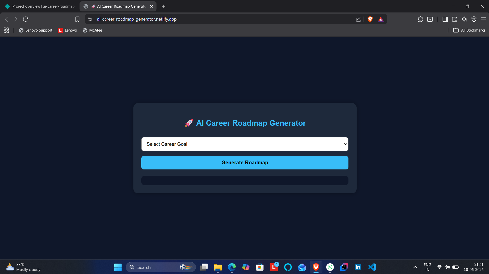
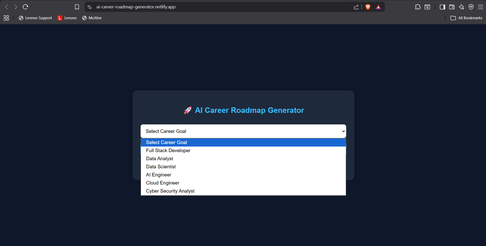
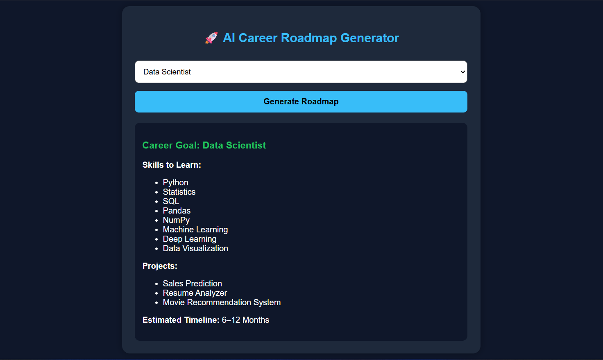

# AI Career Roadmap Generator

🚀 Day 2 of my 30 Days 30 AI Websites Challenge

AI Career Roadmap Generator is a simple web application that helps students and beginners explore different technology career paths and understand what skills, projects, and learning roadmap are required to achieve their goals.

## 🌐 Live Demo

https://ai-career-roadmap-generator.netlify.app/

## 📸 Screenshots

## ✨ Features

* Career Path Selection
* Personalized Learning Roadmap
* Required Skills List
* Recommended Project Ideas
* Estimated Learning Timeline
* Beginner-Friendly Interface

## 🎯 Supported Career Paths

* Data Scientist
* AI Engineer
* Full Stack Developer
* Data Analyst
* Cyber Security Analyst
* Cloud Engineer

## 🛠 Technologies Used

* HTML
* CSS
* JavaScript
* AI-Assisted Development

## 📋 How It Works

1. Select your desired career.
2. Click "Generate Roadmap".
3. View:

   * Required Skills
   * Recommended Projects
   * Learning Timeline
   * Career Roadmap

## 🚀 Example

Career Goal: Data Scientist

Skills:

* Python
* SQL
* Statistics
* Pandas
* NumPy
* Machine Learning
* Deep Learning

Projects:

* Sales Prediction
* Resume Analyzer
* Recommendation System

Timeline:
6–12 Months

## 🎯 Challenge

This project is part of my 30 Days 30 AI Websites Challenge where I build and publish one AI-assisted website every day.

### Progress

* Day 1 ✅ AI Resume Analyzer
* Day 2 ✅ AI Career Roadmap Generator

## 👨‍💻 Author

Anand,

B.Tech CSE (Data Science)
